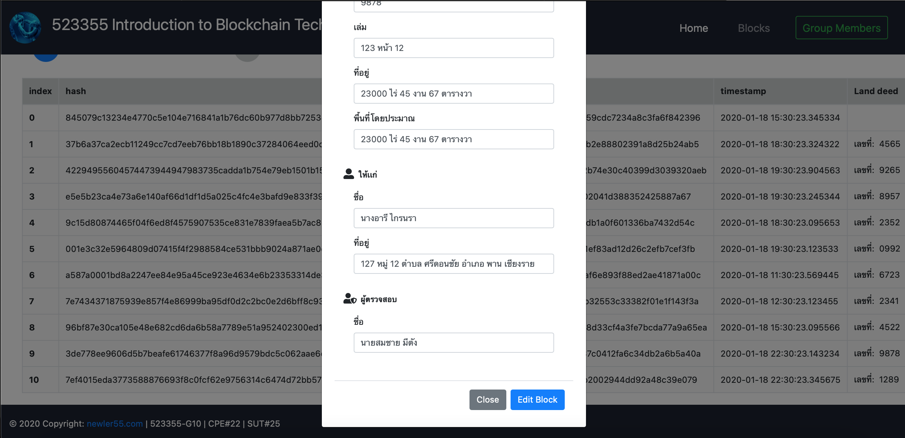

# flask-blockchain
#### Minicond install
* miniconda.html@latest [Click](https://docs.conda.io/en/latest/miniconda.html)
* bash Miniconda3-latest-*.sh
* conda create -n <name_env> python=3.6 pip

#### RUN APP

* `git clone https://github.com/newler55/flask-blockchain.git`
* `pip install -U Flask`
* `cd flask-blockchain`
* `python blockchain.py`
* `[open browser] http://localhost:8080/`
  
#### SUPPORT
* `https://www.python.org/downloads/`
* `http://flask.palletsprojects.com/en/1.1.x/`
* `https://getbootstrap.com/docs/4.0/getting-started/introduction/`
* `https://fontawesome.com/icons?d=gallery`

### UX/UI - Test
* 1-Home.png
  
</img>

* 2-Home.png
  
</img>

* 3-Home.png
  
</img>

* 4-Add-Block.png
  
</img>

* 5-Add-Block.png
  
</img>

* 6-Blocks.png
  
</img>

* 7-Blocks.png
  
</img>

* 8-Edit-Block.png
  
</img>

* 9-Edit-Block.png
  
</img>

* 10-Blocks.png
  
</img>

* 11-Group.png
  
</img>

  
